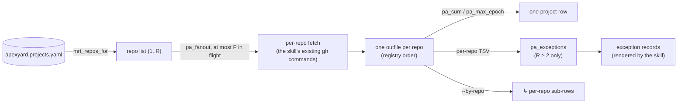

<!-- Source: ApexYard · docs/technical-designs/portfolio-multi-repo-aggregation.md · github.com/me2resh/apexyard · MIT -->

# Technical Design — Portfolio-View Aggregation Across a Multi-Repo Project's Repos

**Status**: In Review
**Author**: Hisham (Tech Lead) — drafted via Claude Code session
**Date**: 2026-09-07
**Ticket**: [me2resh/apexyard#1138](https://github.com/me2resh/apexyard/issues/1138)
**Builds on**: [AgDR-0121](../agdr/AgDR-0121-multi-repo-registry-project.md) — the `repos:` / `primary:` schema and its shipped accessors `mrt_repos_for` / `mrt_primary_repo_for` in `.claude/hooks/_lib-multi-repo-trace.sh`
**Reviewer**: Tariq (Solution Architect) — Gate 3b, before Build

---

## Overview

### Summary

The five portfolio-view skills (`/projects`, `/inbox`, `/tasks`, `/status`, `/handover`) will read a project's full repo list and aggregate across it, so a multi-repo project's one row reports the whole product instead of only its primary repo. Each field folds by its own rule: counts sum, CI is worst-of, activity is newest, harnessability is never averaged, contributors are a union. Rendering is one row per project, per-repo detail only on exception, plus an explicit `--by-repo` drill-down — the operator's choice, not reopened here. This design decides six points: the exception rule per skill (D1), the fetch strategy (D2 — parallel per-repo fetch under a concurrency cap, reusing each skill's existing commands; GraphQL batching and a remote-state cache rejected with a named revisit trigger), where the shared logic lives (D3 — one library, `.claude/hooks/_lib-portfolio-aggregate.sh`), action targeting per skill (D4), how singular-`repo:` byte-identity is asserted (D5), and where `/handover`'s clones land for a multi-repo project (D6 — a container directory per project). The AgDR is co-filed here as AgDR-0133, not deferred. Next action: Tariq reviews via `/design-review`; on approval, implementation opens with the shared library.

### Readiness

**Complete — no open questions.** The question the first draft left open (where `/handover`'s non-primary clones land) is decided in D6, so task 8 is unblocked and every task in § Implementation Plan has a decided input. The decision rests on read code and measured behaviour, both cited: the path-to-project attribution idiom shared by the two gate hooks and `briefing.sh` (D6), and the git probes in § Context.

Three limits stand, and none blocks implementation. First, the reference portfolio registers 32 projects, 30 of them with a singular `repo:` and none with `repos:`, so **every multi-repo path ships fixture-tested only** — § Testing Strategy states what that covers and what it does not. Second, D6 forces two small changes outside the first draft's surface (`briefing.sh` branch resolution, `mrt_offer_clone`'s clone path); both are listed in § Architecture and are better confirmed in review than discovered in implementation. Third, two pre-existing framework inconsistencies were recorded here: the `jq -s '.[0] * .[1]'` config merge was described as shallow in three places when `*` recurses into objects and replaces arrays (D1), and `/handover`'s Rule 1 calls steps 8.5 and 8.6 the only sanctioned writes into the target repo while step 5.5 also writes into its working tree (D4). The config wording is corrected by #1207; the handover wording remains a separate follow-up. Neither affects this design's implementation.

One D6 behaviour is worth naming here rather than leaving in a table. When a newly added repo makes two directory names collide, the whole project flips to `<owner>__<repo>` and every existing clone is suddenly at the wrong name. `/handover` reports those renames instead of performing them, which keeps the never-move-adopter-data rule but means a rerun in that state needs one manual step.

### Goals

- A multi-repo project renders as one row whose PR count, issue count, and activity cover every repo in `repos:`.
- The repo that needs attention is named when, and only when, it needs attention (red CI, unreachable, stale, blocked), and always under `--by-repo`.
- Singular `repo:` projects render byte-identically to today, asserted mechanically at the library level and by a before/after smoke.
- One implementation of the aggregation semantics, consumed by all five skills.
- The cost of a portfolio view stays bounded and stated: calls and latency at 1, 3, and 8 repos.

### Non-Goals

- The `repos:` schema, the security consumers, and leak-scrub behaviour — shipped in v5.4.0 under AgDR-0121. Leak-scrub keeps treating every repo equally and ignoring `primary:`; nothing here touches it.
- `/start-ticket`, PR creation, and board automation. They already accept an explicit `owner/repo#N` or are repo-agnostic (AgDR-0121 found `_lib-project-board.sh` needs no change).
- Cross-project parallelism. A 30-project singular portfolio already costs `/inbox` about 270 serial `gh` calls; that latency predates this ticket and is a separate follow-up.
- GraphQL batching and a remote-state cache — evaluated in D2 and deferred with a trigger.
- Lifting the 30-item cap on the `/projects` counts (D5). It is a pre-existing under-count; changing it changes singular output, so it belongs to its own ticket.
- The forge abstraction for PR sections (#711). PR-axis fetches stay GitHub-only, as today.
- `/stakeholder-update`, which also walks the registry. Not in the ticket's scope; it can adopt the library later.

---

## Context

AgDR-0121 made a multi-repo product one registry entry and made every *security* consumer read the full list. It deferred the five portfolio-view skills, which still fetch from one repo per entry. The ticket settles the aggregation semantics per field and the rendering option (C as default, D as drill-down). Each decision below answers one of its open points.

Facts this design relies on — observed 2026-09-07 with `gh` 2.100.0 on macOS, against `me2resh/apexyard` as the proxy repo:

| Measurement | Value |
|---|---|
| `gh -R <repo> pr list --state open --json number --jq length` | 0.41–0.45 s per call (3 samples) |
| `gh -R <repo> issue list --state open --json number --jq length` | 0.43–0.47 s |
| `gh -R <repo> pr list --state open --json number,statusCheckRollup` | 0.66–0.87 s |
| `gh repo view <repo> --json pushedAt` | 0.46 s |
| 8 list calls, serial | 3.29 s |
| 8 list calls, `xargs -P 4` / `xargs -P 8` | 1.00 s / 0.60 s |
| One GraphQL query, 8 aliased repos, counts + default-branch check rollup | 0.53 s, 1 call |
| Budgets reported by `gh api rate_limit` | core 5000/h · GraphQL 5000 points/h · search 30/min |
| `gh ... list --json number --jq length` on a repo with 40 open issues | reports **30** — the default `--limit` |

Clone-layout behaviour, probed the same day with git 2.55.0 on the same host, against a throwaway pair — a parent repo with a second repo inside its working tree. These decide D6:

| Probe | Result |
|---|---|
| `git status --porcelain` in the parent, nested repo present | `?? worker/` — the parent's dirty count gains 1 per nested repo |
| Same, after one `worker/` line in the parent's `.git/info/exclude` | empty — dirty count 0 |
| `git add worker` | `warning: adding embedded git repository`; stages mode `160000`, a gitlink |
| `git clean -fd` in the parent, no exclude | nested repo survives |
| `git clean -ffd` in the parent, no exclude | nested repo **removed** |
| `git clean -ffd` with the exclude in place | survives |
| `git clean -ffdx` with the exclude in place | nested repo **removed** |
| `git branch --show-current` in a plain directory inside a git repo | prints the **enclosing** repo's branch; `rev-parse --show-toplevel` returns the enclosing repo |

The reference portfolio used to author this design registers 32 projects: 30 carry a singular `repo:`, none carries `repos:`, and 29 of those 30 workspaces are cloned; one registered entry has no workspace directory at all. Every multi-repo code path is therefore adopter-facing and cannot be validated against live data here; § Testing Strategy states what that means.

---

## Key Decisions

### D1 — What counts as an exception, per skill

An exception is a condition the skill **already** surfaces for a singular project as a warning or an attention item, now evaluated per repo. Per-repo detail names the repo the condition came from and nothing else. This keeps the default compact and makes the rule a pure function of fixture values.

| Skill | Per-repo exception conditions | Per-repo detail rendered by default | `--by-repo` |
|---|---|---|---|
| `/projects` | **unreachable** — the repo's fetch failed (`?`). **stale** — the repo's last activity is older than `portfolio.stale_days` *while the project's newest activity is not*; when the whole project is stale only the existing project-level ⚠ fires and no per-repo line is added | One `⚠ <project> › <owner/repo>: <condition>` line per (repo, condition), after the table beside the existing ⚠ lines | Indented sub-rows under the project row: `↳ <owner/repo>` with PRs · Issues · Last activity |
| `/status` | **red CI** — any open PR in the repo maps to `❌ CI failed`. **unreachable** | At R ≥ 2 the header gains the space-separated suffix `· <R> repos`; at R = 1 it is byte-identical to today — `PROJECT: <name>  (<status>)`, two spaces, no suffix. A `Repos: ❌ <owner/repo> (<k> PR failing CI) · ? <owner/repo> (unreachable)` line follows only when ≥ 1 exception holds | A per-repo sub-block (Open PRs, Recently merged) for every repo |
| `/inbox` | None — every item is already an exception; the repo-qualified ref (D4) is the detail | — | A per-repo tally under the Summary line |
| `/tasks` | None — as `/inbox` | — | A per-repo tally under the item count |
| `/handover` | **low harnessability** or **failing build** in any repo | Always per repo: the assessment is a one-shot document, and "never a mean" requires per-repo visibility (the ticket's own rule). Project verdict = worst-of | Not offered — per repo is the default |

**Every per-repo exception path is gated on R ≥ 2.** At R = 1 the library emits zero exception records and each skill renders exactly today's strings: no `⚠ <project> › <owner/repo>` line for **unreachable** or **stale**, no `Repos:` line for **red CI** or **unreachable**, and no `· <R> repos` header suffix. One rule over the whole table, not a per-condition carve-out — and it is what makes § Backward Compatibility's claim derivable instead of merely asserted. The `stale_days` scoping below is a consequence of this gate, not a separate one.

Testable statement, and the reason `pa_exceptions` exists (D3): given per-repo fixture values, the exception **set** is a pure function of those values and the thresholds above, computed in the library and asserted in shell. Only its typography lives in skill prose.

#### `stale_days` is a new threshold, not an existing one

`/projects` defines no numeric staleness contract today. It reads `LAST=$(git -C {workspace} log -1 --format='%h %ar %s')` from the local clone — a relative-time *string* — renders it in the Last Commit column, and prints `-` when the workspace is not cloned. The ⚠ attention lines are specified only as "flag rows that need attention", and the one worked example (`⚠ marketing-site: last commit 30 days ago (paused or stale?)`) is sample output, not a threshold. Whether a row is flagged is a judgement the skill makes from the rendered string.

So this threshold is **new**. It is introduced explicitly as `portfolio.stale_days`, default `30`, read by `pa_stale_days` with the same shape as `pa_concurrency`. The library falls back to a literal in-code default when the key is absent, because the file or the key may simply not be there — an adopter with no `.claude/project-config.json`, or a defaults file predating the key. **Not** because a `portfolio` override would drop it: `_lib-read-config.sh` merges with `jq -s '.[0] * .[1]'`, and jq's `*` recurses into objects, so an override naming only `portfolio.registry` keeps `stale_days` (measured). It replaces **arrays** wholesale. The shared config guidance documents both behaviors.

Its scope is deliberately narrow: **it governs the per-repo exception rule only, and only at R ≥ 2.** A singular project keeps today's judgement-based ⚠ untouched, which is what keeps D5's byte-identity claim true. Giving singular projects a numeric threshold would change today's output, so it belongs to its own ticket alongside the 30-item count cap.

Mechanically a per-repo comparison needs an epoch, which `%ar` does not give. **At R ≥ 2 every repo's epoch comes from `gh repo view --json pushedAt`, the primary included.** At R = 1 no epoch is computed and no comparison runs.

The primary's local clone is not an acceptable source. `git log -1` reports the newest commit **as of the last fetch**, and that lag is unbounded — a clone nobody has pulled for 45 days reports 45-day-old activity for a repo that is busy on the remote, so the rule would name the product's most active repo as dormant. It can also run ahead, through unpushed local commits. D2 rejects a TTL cache one section earlier as the confidently-wrong failure AgDR-0120 exists to avoid; an unfetched clone is remote state served from a cache with no TTL at all. The two sections have to reach the same verdict, and now do: at R ≥ 2 the activity axis reads the forge.

The rendering consequence, stated so it is not discovered later: at R ≥ 2 the Last Commit cell derives from the `pushedAt` fold and reads `<relative time> — (push to <owner/repo>)`, so the column reports last *activity* across the product rather than local commit state. At R = 1 the cell is today's `git -C {workspace} log -1 --format='%h %ar %s'` string, untouched.

### D2 — Fetch strategy: parallel per-repo fetch, concurrency cap, existing commands

Chosen: run each skill's **existing per-repo commands** once per repo from `mrt_repos_for`, with at most `P` repos in flight. `P` is `.portfolio.fetch_concurrency` in `.claude/project-config.json` (default 4; `1` means serial). Results are collected, then rendered in registry order, so parallelism never changes output.

| Option | Verdict |
|---|---|
| **A. One batched GraphQL query per project** — measured 0.53 s for 8 repos, 1 call | Rejected for v1. It changes the data source for **every** project, singular included: `totalCount` reports 40 where today's command reports 30 (§ Context), so singular output is not byte-identical. It re-forks the issue axis to GitHub-only, undoing AgDR-0093's tracker-agnostic `tracker_list`. Using it only for R ≥ 2 would create two resolvers for one field — the shape #1182 is unwinding. And it is a fetch-layer rewrite of five skills for a feature with zero live instances. |
| **B. Parallel fetch with a concurrency cap** | **Chosen.** Zero change to what is fetched or how it is rendered; R = 1 runs the identical command sequence. Latency scales with ⌈R / P⌉, not R. Bash 3.2 compatible — `xargs -P` and background jobs both work on stock macOS and GNU. |
| **C. Short-lived cache keyed on repo + HEAD** | Rejected. HEAD is not a valid key for PR and issue counts (they change without HEAD moving), and learning HEAD costs a call. A TTL cache serves a stale red or green CI on a dashboard whose job is "what needs attention now" — the confidently-wrong failure the framework's cache design (AgDR-0120, "correct-or-cold") exists to avoid, and remote state cannot meet that bar. |

**Revisit trigger for A:** a measured `/projects` or `/status` run above 5 s attributable to one project's repo count. Then adopt GraphQL **uniformly**, in its own ticket, with the singular output change declared and asserted.

**Expected cost** — calls per project; latency extrapolated from the per-call figures in § Context at `P = 4`. `pa_fanout` caps **repos** in flight, not calls (D3): each job runs its own repo's calls serially, so a project's latency is about `⌈R / P⌉` × one repo's serial cost. Adding the `pushedAt` fetch therefore lengthens each job by one call rather than adding a wave — which is why the R = 3 figure below is unchanged from the pre-`pushedAt` draft:

| Skill | Per-repo calls | R = 1 | R = 3 | R = 8 |
|---|---|---|---|---|
| `/projects` | 2 (PRs, issues); at R ≥ 2, plus 1 `pushedAt` for **every** repo, the primary included (D1) | 2 calls · ~0.9 s (unchanged) | 9 calls · ~1.4 s | 24 calls · ~2.8 s (`P = 8`: ~1.5 s) |
| `/status` | 2 (open PRs with checks, recent merges) | 2 · ~1.2 s (unchanged) | 6 · ~1.3 s | 16 · ~2.6 s |
| `/inbox` | 9 (4 PR searches, 3 `tracker_list`, 2 reconcile) | 9 · ~4 s (unchanged) | 27 · ~4.5 s | 72 · ~8 s (`P = 8`: ~4 s) |
| `/tasks` | ~8, plus one per open authored PR for comment threads (as today) | as `/inbox` | as `/inbox` | as `/inbox` |
| `/handover` | One-shot: per-repo clone and local reads | unchanged | 3× today | 8× today |

Rate limits: the cap bounds the burst rate, not the total. An `/inbox` over a portfolio of many 8-repo projects is the first place the hourly budget could bind; that is the same signal as the revisit trigger above.

### D3 — Where the aggregation logic lives: `.claude/hooks/_lib-portfolio-aggregate.sh`

One shared library, sourced by the five skills after `_lib-read-config.sh`, `_lib-portfolio-paths.sh`, and `_lib-multi-repo-trace.sh`. Same home and shape as `_lib-tracker.sh` and `_lib-multi-repo-trace.sh` — libraries under `.claude/hooks/` that skills already source. Read-only; bash 3.2; never wired into `settings.json`.

| Function | Contract |
|---|---|
| `pa_concurrency` | Prints `P`: `.portfolio.fetch_concurrency` from project config, default `4`; `1` means serial. |
| `pa_fanout <fn> <repo>…` | Runs `<fn> <repo>` for each repo with at most `P` in flight (waves of `P`). Prints one line per repo **in input order**: `<repo>\t<exit>\t<outfile>`. Each job's stdout is captured verbatim in `<outfile>` under one `mktemp -d` directory; `pa_fanout_cleanup` removes it (the caller traps it on exit). Never fabricates output: a failed job has a non-zero exit and its file holds only what the command printed. |
| `pa_sum <v>…` | Integer sum of the readable values. If any value is `?` the result carries a suffix (`12+?`); all `?` → `?`. One value → that value, verbatim. |
| `pa_max_epoch <v>…` | The newest epoch among readable values; `?` and empty ignored; none → `-`. |
| `pa_worst_ci <v>…` | `FAILURE` > `PENDING` > `SUCCESS` > `NONE`; `?` handled as in `pa_sum`. |
| `pa_union` | `sort -u` over stdin lines. Used for contributors, keyed on author email. |
| `pa_exceptions <skill> <R>` | Reads one normalised TSV record per repo on **stdin**, registry order — `<repo>\t<exit>\t<ci>\t<activity-epoch>`, with `-` in any field that skill does not fetch — and prints the exception set as **data**: one `<repo>\t<condition>` record per line, registry order, or nothing. `<skill>` selects the condition set from D1 (`projects` → `unreachable`, `stale`; `status` → `red-ci`, `unreachable`; `inbox` and `tasks` → none; `handover` → every repo, unconditionally). Emits nothing when `<R>` is 1, whatever the records say (D1's gate). This is what makes the exception rule a shell-testable function rather than a prose judgement (AT-3, AT-4). |
| `pa_stale_days` | Prints the staleness threshold in days: `.portfolio.stale_days` from project config, default `30`. |
| `pa_is_stale <epoch> [days]` | Exit 0 when the epoch is older than `days`; `days` defaults to `pa_stale_days`. Called only at R ≥ 2 (D1). |

Two rules of the contract:

- **Repo enumeration is not wrapped.** Skills call `mrt_repos_for` and `mrt_primary_repo_for` directly. A second resolver for "which repos does this project have" is exactly the duplication #1182 is paying for. D6 changes a third function in that same library, `mrt_offer_clone`; the two enumeration accessors are untouched.
- **There is no averaging function.** `pa_mean` does not exist and must not be added. Harnessability is rendered per repo and folded by worst-of only.

Each skill keeps its own per-repo fetch as a small inline function — its **existing** commands, unchanged — and passes it to `pa_fanout`. The library owns scheduling, folding, the stale rule, and the exception set; the skill prose owns which fields to fetch and where the lines go. A skill **renders** the records `pa_exceptions` emits; it never decides them. This split is what keeps R = 1 byte-identical (D5): the fetch command is the same string as today, and every fold of one value is the identity.

### D4 — Action targeting, per skill

Reads use the AgDR-0121 default (`primary:` if set, else the first entry of `repos:`) via `mrt_primary_repo_for`. Writes into a project with ≥ 2 repos and **no explicit `primary:`** prompt once, naming the repos, before acting. Every `gh` and tracker call passes an explicit repo, never the ambient cwd (`.claude/rules/ticket-vocabulary.md` § Repo targeting).

| Skill | Needs *the* repo for | Behaviour |
|---|---|---|
| `/projects` | Nothing — read-only | `--json` rows for multi-repo projects gain `repos`, `primary`, and `by_repo`; singular rows are unchanged. |
| `/inbox` | Nothing — every item carries its own URL | Items of a multi-repo project are prefixed `owner/repo#N` — the qualified form `/start-ticket` already accepts — never the ambiguous `project#N`. Singular projects keep `project#N`. The mentions section's registry filter is the union of every project's `mrt_repos_for`. |
| `/tasks` | Nothing — per-item URLs | Same ref rule as `/inbox`; the `--json` `id` uses it too, while `project` stays the registry name. |
| `/status` | Section D — `gh issue view` for the in-progress issue | Repo = the active-ticket marker's `repo=` field when present (what `briefing.sh` already does), else `mrt_primary_repo_for`; always `--repo`. Section A (git state) reads the one `workspace:`, which is the primary's clone — unchanged. |
| `/handover` | The registry append (step 7), ticket filing (step 7.5), and **every write into the adopted repo** (steps 5.5, 8.5, 8.6 — see below) | Writes `repos:` plus an explicit `primary:` — the first repo given, or `--primary <owner/repo>`. Files tickets into `primary:`. On a re-run against a hand-edited entry with ≥ 2 repos and no `primary:`, prompt once. In-repo artefacts go to an explicitly selected repo set, never silently to `primary:`. |

#### In-repo writes into the adopted repo

The table above covers writes into the **ops fork**. `/handover` also writes into the **adopted repo**, and earlier drafts of this design named none of them. There are three, and this is the complete set as the skill ships:

| Step | Write | Delivery | Consent today |
|---|---|---|---|
| 5.5 | Topology CI pipelines into `<repo>/.github/workflows/*.yml` | Working tree only — not committed, not pushed | Follows the topology pick; no separate confirmation |
| 8.5 | `AGENTS.md`, plus a one-line `@AGENTS.md` shim as `CLAUDE.md` when no `CLAUDE.md` exists | Branch `docs/agents-md` + PR | Opt-in, default-OFF, confirmed per run |
| 8.6 | A "Governed by ApexYard" README badge | Branch `docs/apexyard-badge`, or onto 8.5's branch | Opt-in, default-OFF, confirmed per run |

Step 5.5 is worth flagging on its own: the skill's Rule 1 calls steps 8.5 and 8.6 "the only two sanctioned writes into the target repo", but 5.5 also writes into the clone's working tree, uncommitted and without its own confirmation. That is a pre-existing inconsistency in the skill, not something this design introduces; it is named because a multi-repo handover multiplies it.

Checked and **not** writes, so the set above can be read as complete: the `git clone` itself, the harness-adapter install command (step 1.6 prints it, never runs it), the branch-protection check (read-only API), `bin/install-git-hooks.sh` (deliberately not invoked, per PR #1087's security review), and the MCP reindex.

**The target rule.** At R ≥ 2, one prompt precedes all three writes, listing the repos with the primary preselected; the selected set receives the artefacts:

```text
<name> has 3 repos. Which should receive in-repo artefacts (AGENTS.md, badge, CI pipelines)?
  [1] owner/api (primary)   [2] owner/gateway   [3] owner/worker
Select [default: 1]:
```

At R = 1 there is no prompt and nothing changes — today's flow exactly.

It is a prompt rather than a primary-only default for two reasons. `AGENTS.md` is a **per-codebase** operating manual — build commands, layout, conventions — so one file generated from the primary is wrong for a gateway or a worker; the artefact does not generalise across a product the way `primary:` does for a tracker. And writing to every repo instead would open an externally-visible PR per repo from a single tick, which is the bulk-implied consent the skill's own Rule 23 already forbids for exactly this class.

**The path rule, which matters more than the target rule.** Six sites hardcode `$WORKSPACE_DIR/<name>` as the repo root — three that write, three that read:

| `SKILL.md` | Side | What it sets |
|---|---|---|
| 735–739 | write | Step 5.5's `.git` guard and its `mkdir` / `cp` targets |
| 1368 | write | `REPO=` for step 8.5 |
| 1536 | write | `REPO=` for step 8.6 |
| 172 | read | "All subsequent reads in steps 2–6 use `$WORKSPACE_DIR/<name>/` as the repo root" |
| 339 | read | "Use `$WORKSPACE_DIR/<name>/` as `<repo>`" — the harnessability scan root |
| 285 | read | `git -C "$WORKSPACE_DIR/<name>" symbolic-ref` — the default branch steps 8.5 and 8.6 branch from |

Under D6 that path is the **container directory**, not a repo. The write side fails loudly: step 5.5 finds no `.git` and defers, 8.5 and 8.6 attempt a branch and a PR in a non-repo. **The read side fails silently, and is the worse half.** Lines 172 and 339 would scan the container, so steps 2–6 read all N clones as one tree and produce a single blended harnessability score — a plausible number, not an error, and no test in this design's suite would see it. That is precisely the failure D6 rejects the nested layout for, reproduced under the layout chosen to avoid it. Line 285 would resolve no default branch, leaving 8.5 and 8.6 to fall back to `main`.

So **`/handover` records each repo's clone path at intake, and every later read and write uses the recorded path. No step re-derives a repo root from `<workspace_dir>/<name>`.** Same discipline as D6's registry `workspace:` — resolve once, never re-derive.

### D5 — Backwards compatibility: how byte-identity is asserted

`repo: X` ≡ `repos: [X]` with no `primary:` (AgDR-0121). This design adds a third equivalence: **for R = 1 the aggregated row equals the un-aggregated row.** Three assertions, from mechanical to manual:

1. **Library unit tests** — `.claude/hooks/tests/test_portfolio_aggregate.sh`: every fold of one value is the identity, `?` included; `pa_fanout` with one job reproduces the job's stdout byte-for-byte; output order equals input order at `P = 1` and `P = 4`; a failed job yields `?` at the fold, never a number.
2. **Registry equivalence** — a new Part 4 in `.claude/hooks/tests/test_multi_repo_registry.sh`, on the fixture shape it already uses (`solo-app` singular vs `one-elem` one-element `repos:`, plus the multi-repo `some-platform`): under a mock `gh`, the fan-out and fold output for `solo-app` and `one-elem` is byte-identical, and `some-platform` yields the summed counts, the newest activity, and exactly the exception lines its fixture values imply. `.claude/hooks/tests/_lib-mock-gh.sh` — today it intercepts `gh issue view` only — gains `pr list`, `issue list`, and `repo view` intercepts keyed by repo, so the suite never touches the network.
3. **Rendering smoke** — recorded in the implementation PR's Testing section: `/projects` before and after on the reference portfolio (the 30 singular entries, 29 of them cloned), captured within the same minute and diffed; any difference must be explained by live data movement, not structure.

The rendered row is produced by skill prose, so (3) is the only assertion at the rendering layer; (1) and (2) are what make it a formality rather than a hope.

**A pre-existing under-count stays.** `gh ... list --json number --jq length` reports at most 30 (§ Context). The sum of capped values is itself capped per repo. Byte-identity forbids fixing this here; it is named so the implementation does not fix it in passing and break (3).

### D6 — Where `/handover`'s clones land for a multi-repo project

Chosen: **a container directory per project.** `<workspace_dir>/<name>/` holds one clone per repo at `<workspace_dir>/<name>/<repo-name>/`, the primary included, and is itself a plain directory rather than a clone. The registry's `workspace:` names the primary's clone explicitly — `workspace/<name>/<primary-repo-name>` — so nothing re-derives that path at read time.

**Singular projects do not move.** `<workspace_dir>/<name>/` stays the clone and `workspace: workspace/<name>` stays as written. The container layout applies only to an entry whose `repos:` holds ≥ 2 repos.

The directory name is the repo half of `owner/repo`. When two repos in one project share that half (`org-a/api` and `org-b/api`), **every** repo in that project uses `<owner>__<repo>` instead, so the rule stays uniform inside a project. `/handover` resolves the name once at intake and records the primary's path in `workspace:`.

#### The constraint that decides it

A path is attributed to a project by **its first segment under the workspace dir**. Three readers share that idiom, and the writer they read against keys its marker on the registry project name:

| Consumer | Code |
|---|---|
| `.claude/hooks/require-active-ticket.sh` — ticket gate | `tail="${FILE_PATH#$WORKSPACE_DIR/}"; PROJECT="${tail%%/*}"` (lines 493–494, 504–505) |
| `.claude/hooks/require-migration-ticket.sh` — migration gate | same idiom (lines 199, 207) |
| `.claude/skills/status/briefing.sh` — active workspace | `rel="${cwd#"$workspace_dir"/}"; workspace="${rel%%/*}"` (lines 105–106, 111–112) |
| `.claude/skills/start-ticket/SKILL.md` — marker write | `tickets/<project>` and `tickets/<project>/<safe-branch>`, keyed on the **registry** project name |

A clone whose first segment is not the registry name is therefore governed but mis-attributed.

| Layout | Verdict |
|---|---|
| **Sibling** — `<workspace_dir>/<name>--<repo-name>/`, the first draft's proposed default | **Rejected.** The first segment is `<name>--<repo-name>`, so both gates resolve a project that has no marker: tiers 0 and 1 miss and the write falls through to the ops-level `current-ticket`. A ticket set for unrelated framework work would then authorise an edit inside a managed repo — a wrong-ticket pass, not a block. Fixing it means teaching two trust-chain hooks a second project-resolution rule: the Heavy path, and a wider gate surface, bought for a directory name. |
| **Nested** — non-primary clones inside the primary's working tree | **Rejected**, though it attributes correctly and needs no hook change. The primary's tree gains an embedded repo per non-primary, so `git status --porcelain` reports `?? <repo>/` — the exact command `/projects` uses for its Dirty column. One `.git/info/exclude` line removes that and also protects the nested clones from `git clean -ffd`, leaving only `git clean -ffdx` destructive (all measured, § Context). The deciding cost is different: every file-system scan in `/handover` steps 2–6 treats `<workspace_dir>/<name>/` as one repo root, so a nested worker's files land in the **primary's** harnessability score unless each scan carries an exclusion it does not carry today. A missed exclusion blends two repos' scores silently — precisely the failure the ticket's "never averaged" rule exists to prevent. |
| **Container** — one clone per repo under a plain project directory | **Chosen.** The first segment is `<name>` for every repo, so both gates and `briefing.sh` attribute correctly with no hook change. Each repo is a self-contained tree, so a per-repo scan cannot blend repos. No embedded repo, so no `git status` pollution and no `git clean` hazard. |

**This decision is not safe on its own.** The container gives each repo a self-contained tree, but that prevents blending only if `/handover` actually scans each tree. Three read sites treat `<workspace_dir>/<name>/` as the repo root (`SKILL.md` 172, 339, 285), and under this layout that path is the container holding all N clones — so leaving them unchanged reproduces the nested layout's blended score under the layout chosen to avoid it. The rejection argument above therefore **depends on** D4's path rule, which carries the full six-site list. Read the two sections together.

#### What the container costs

Two changes it forces, both in scope and both small:

- **`briefing.sh` branch resolution.** Two bare `[ -d ]` branches — lines 194–195 and the `elif` at 196–197 — set `branch_dir` to `<workspace_dir>/<workspace>` or `<ops_root>/workspace/<workspace>`, and `git branch --show-current` runs there. On a plain container directory git walks up and reports the **enclosing** repo's branch: the ops fork's in single-fork mode, the portfolio repo's in split-portfolio mode (measured, § Context). It is worse than one wrong branch. Line 190 defaults `branch_dir` to `$cwd`, which for an operator standing inside a real clone is the **correct** answer, and a container match then overwrites it with the wrong one. Both branches must prefer the cwd's own git toplevel when the cwd is inside a git repository under the workspace dir, and the registry's `workspace:` otherwise. Nothing today distinguishes a container from a clone.
- **`mrt_offer_clone`.** It prints `git clone <url> <workspace_dir>/<name>`, ignoring the registry's `workspace:` field, which for a multi-repo project names the container rather than the primary's clone. It must prefer `workspace:` when set. This is also a latent fix for any singular project with a custom `workspace:`, whose suggested clone path is wrong today. It moves `_lib-multi-repo-trace.sh` out of D3's "reused unchanged" list.

Reading git state is guarded the same way everywhere rather than on a multi-repo-only branch: a workspace path is read for git data only when `git -C <path> rev-parse --git-dir` succeeds, and otherwise renders `(not cloned)`. One resolver, per D3. For the 29 cloned singular entries the guard passes and output is unchanged. The thirtieth entry has no workspace directory at all, so today's `[ -d ]` test already fails and the row already reads `(not cloned)` — the guard does not change it either. The only shape the guard changes is a workspace directory that exists but is not a repo, which no entry currently has, and where today's test yields the enclosing repo's branch — a wrong answer, not a preserved one.

One migration is documented rather than automated: converting an existing singular project to `repos:` means moving its clone down one level and updating `workspace:`. Zero projects need this today.

#### Rerun, cleanup, failure

Per-repo status replaces today's single `CLONE_STATUS`, keeping the same four values (`cloned` / `preserved` / `declined` / `failed: <reason>`) once per repo. The step-10 summary lists them per repo.

| Case | Behaviour |
|---|---|
| Rerun, directory present and its `origin` matches the registered repo | `preserved` — no clone, no fetch, no overwrite. Today's rule, now per repo. |
| Rerun, directory present but not a git repo, or `origin` does not match | `failed: <reason>` for that repo. **Never deleted, never overwritten.** A path that already holds something else must not be assessed as if it were the registered repo. |
| `--no-clone` | Every repo `declined`; the whole assessment runs API-only, as today. |
| Clone fails for one repo | That repo assesses from the API, its row reads `failed: <reason>`, and its harnessability renders `?` — never a score, and the row is never dropped. `/handover` does not abort. |
| Clone fails for the primary | Today's behaviour exactly: report the exit code, point at `gh auth login` or a manual `git clone`, continue degraded. |
| Rerun after a new repo makes two directory names collide, flipping the project to `<owner>__<repo>` | Every repo's expected directory changes at once, so a plain rerun would find nothing at the new names, re-clone all of them, and orphan the old directories. `/handover` instead detects existing directories at the **old** names whose `origin` matches a registered repo and **reports** the renames it would need, one `mv` line per repo, without performing them. Same rule as the rows above: it never moves or deletes a directory it did not create in this run. |
| A repo is dropped from `repos:` | `/handover` **never deletes a clone.** It prints one line naming the now-unreferenced path and the `rm -rf` the operator can run. A clone can hold uncommitted work; destroying it stays a deliberate human act. |
| Project verdict with some repos unassessed | Worst-of the assessed repos, annotated `(<k> of <R> unassessed: <owner/repo> — <reason>)`. A bare worst-of over a subset claims a completeness the run does not have. |

MCP reindex is already project-scoped (`reindex(scope="project", project="<name>")`), so one call covers the container. For a multi-repo project that is the intended scope: one product, one index.

### AgDR call

**A new AgDR is needed; AgDR-0121 does not cover this.** AgDR-0121 decided the schema and that every consumer reads the list, and it explicitly left aggregation as "deferred ergonomics" without deciding how. Four decisions above meet the `.claude/rules/agdr-decisions.md` threshold: a shared library consumed by five skills (a cross-cutting pattern), the fetch strategy with two rejected alternatives the ticket itself names (the first thing a future contributor re-litigates when a view feels slow), the rendering default, and D6's clone layout (a repo-wide directory convention, and the one decision that reaches into two trust-chain hooks' attribution assumptions). **Co-filed in this PR** as [AgDR-0133](../agdr/AgDR-0133-portfolio-multi-repo-aggregation.md), not deferred to a task. Precedent: PR #930 (`fe738e0`) added `onboarding-increment-2.md` together with AgDR-0100 and AgDR-0101 in one commit. Co-filing also delivers D6's own risk mitigation — that the decision is recorded with the attribution constraint forcing it — structurally, rather than leaving it to a task someone could skip.

---

## Architecture

### Surface inventory

| Layer | Artifact | New / Changed | Purpose |
|---|---|---|---|
| Decision | `docs/agdr/AgDR-0133-portfolio-multi-repo-aggregation.md` | **New — in this PR** | D2, D3, D6, and the rendering choice (Gate 2) |
| Library | `.claude/hooks/_lib-portfolio-aggregate.sh` | **New** | Fan-out scheduler, folds, stale rule, exception set (D3) |
| Library | `.claude/hooks/_lib-multi-repo-trace.sh` — `mrt_offer_clone` prefers the registry `workspace:` | **Changed** | Clone path for a multi-repo primary (D6) |
| Config | `.claude/project-config.defaults.json` → `portfolio.fetch_concurrency: 4`, `portfolio.stale_days: 30` | **Changed** | The cap `P` (D2) and the staleness threshold (D1) |
| Tests | `.claude/hooks/tests/test_portfolio_aggregate.sh` | **New** | Library contract (D5-1) |
| Tests | `.claude/hooks/tests/test_multi_repo_registry.sh` Part 4 · `_lib-mock-gh.sh` list/view intercepts | **Changed** | Registry equivalence (D5-2) |
| Skill | `.claude/skills/projects/SKILL.md` | **Changed** | Fan-out, folds, ⚠ per-repo lines, `--by-repo`, `--json` keys |
| Skill | `.claude/skills/status/SKILL.md` | **Changed** | Union of PR lists with `owner/repo#N`, `Repos:` line, section-D repo resolution, `--by-repo` |
| Skill helper | `.claude/skills/status/briefing.sh` | **Changed** | Branch resolution prefers the cwd's git toplevel; a container dir is not a clone (D6) |
| Skill | `.claude/skills/inbox/SKILL.md`, `.claude/skills/tasks/SKILL.md` | **Changed** | Iterate `mrt_repos_for`, repo-qualified refs, mentions filter union, `--by-repo` tally |
| Skill | `.claude/skills/handover/SKILL.md` | **Changed** | N-repo intake, container clone layout with per-repo status (D6), per-repo assessment sections, worst-of verdict, contributor union, `repos:` / `primary:` / `workspace:` registry entry, in-repo write target selection and per-repo path resolution (D4) |
| Docs | `docs/multi-project.md`, `CLAUDE.md` skill one-liners | **Changed** | Document the multi-repo rendering and the flag |
| Reused unchanged | `mrt_repos_for` / `mrt_primary_repo_for`, `_lib-tracker.sh` (`tracker_list`), `block-private-refs-in-public-repos.sh`, `require-active-ticket.sh`, `require-migration-ticket.sh` | — | Enumeration, issue-axis listing, leak-scrub, and the two gates D6 keeps working without change |

### Data flow — one project row in `/projects`



Per-repo last activity: at R = 1 the cell is today's `workspace:` clone `git log -1` string, including `-` when the workspace is not cloned. At R ≥ 2 every repo's value is `gh repo view --json pushedAt` (D1), the fold is the newest, and the cell reads `<relative time> — (push to <owner/repo>)`. A local clone is never the activity source at R ≥ 2, whether or not D6's container has cloned that repo, because a clone's freshness depends on when someone last fetched it.

### `/handover` intake for a multi-repo product

`/handover <name> <url-or-path>…` accepts N repos positionally; one repo is today's invocation, unchanged. The first is `primary:` unless `--primary <owner/repo>` is given. Steps 2–4.5 run per repo. The assessment document gains a per-repo table (activity, build status, harnessability with its five dimensions) and a project verdict that is the worst-of. Contributors are the union across repos keyed on author email (`git shortlog -sne`) and rendered by name, so one human in four repos is one line, not four. The registry entry written in step 7 uses `repos:`, an explicit `primary:`, and an explicit `workspace:` naming the primary's clone inside the container directory (D6).

---

## Backward Compatibility & Reuse

- A registry with no `repos:` line never enters a multi-repo path: `mrt_repos_for` yields one line, `pa_fanout` runs one job, every fold is the identity, no exception line or sub-row can appear, and no ref changes form. `--by-repo` on a singular project prints nothing extra.
- The fetch commands in each skill are the same strings as today, so any behaviour they already have — the 30-item cap included — is preserved.
- Only the shipped resolvers are used for enumeration and primary selection; no new parse of the registry is introduced.
- The workspace layout is unchanged for a singular project: `<workspace_dir>/<name>/` stays the clone. D6's container directory applies only where `repos:` holds ≥ 2 repos, so no existing clone moves and no `workspace:` line is rewritten.
- Both gate hooks keep working untouched, because the container's first path segment is still the registry project name (D6).

---

## Implementation Plan

One ticket (#1138), suggested as three PRs so the library merges before the skills depend on it. PR-B and PR-C are file-independent once PR-A lands and can build in parallel.

| # | Task | Est. | Depends on |
|---|---|---|---|
| 1 | Gate 2 confirmation that AgDR-0133 (co-filed in this PR) still matches what is being built; amend it if review moved D2's revisit trigger or D6's layout | 0.25 h | — |
| 2 | `_lib-portfolio-aggregate.sh` — `pa_concurrency`, `pa_stale_days`, `pa_fanout` (waves of `P`, input-order output, temp dir + cleanup), the folds (`pa_sum`, `pa_max_epoch`, `pa_worst_ci`, `pa_union`), `pa_is_stale`, and `pa_exceptions` with its per-skill condition sets and R ≥ 2 gate; bash 3.2 | 4 h | 1 |
| 3 | `test_portfolio_aggregate.sh` covering every fold and `pa_exceptions`; extend `_lib-mock-gh.sh` with list/view intercepts; Part 4 of `test_multi_repo_registry.sh` including AT-1's golden capture and AT-2–AT-4 | 4 h | 2 |
| 4 | `project-config.defaults.json` → `portfolio.fetch_concurrency` and `portfolio.stale_days`, plus their lines in `docs/multi-project.md` | 0.5 h | 2 |
| 4b | `mrt_offer_clone` prefers the registry `workspace:` (D6), with its case in `test_multi_repo_registry.sh` | 0.5 h | 2 |
| — | **PR-A**: tasks 1–4b | | |
| 5 | `/projects` — fan-out, folds, `pushedAt` per repo at R ≥ 2 (D1), the `rev-parse --git-dir` guard before any git-state read (D6), ⚠ lines rendered from `pa_exceptions`, `--by-repo` sub-rows, `--json` keys | 2 h | PR-A |
| 6 | `/status` — union PR lists with `owner/repo#N`, header suffix and `Repos:` line rendered from `pa_exceptions`, section-D repo resolution, the same git-dir guard in section A, `--by-repo` sub-blocks, and `briefing.sh` branch resolution across both `[ -d ]` branches (D6) | 2.5 h | PR-A |
| — | **PR-B**: tasks 5–6, plus the rendering smoke (D5-3) | | |
| 7 | `/inbox`, `/tasks` — iterate `mrt_repos_for`, repo-qualified refs, mentions filter union, `--by-repo` tally | 2 h | PR-A |
| 8 | `/handover` — N-repo intake, the D6 container layout with per-repo clone status and its rerun / cleanup / failure rules including the collision-rename report, per-repo sections, worst-of verdict with the unassessed annotation, contributor union, `repos:` / `primary:` / `workspace:` entry, the D4 prompt rule, and the in-repo write target + path rules (D4 § In-repo writes) — replacing all eight hardcoded `$WORKSPACE_DIR/<name>` repo-root references with the recorded per-repo path: the write sites at `SKILL.md` 735–739, 1368, 1536; the read sites at 172, 339, 285; and the clone preconditions at 1340 and 1487. Task 8 also updates the two operator-facing printed paths at 1295 and 1327 so they name the recorded clone path. | 4.5 h | PR-A |
| 9 | `CLAUDE.md` one-liners; `docs/multi-project.md` on multi-repo rendering, the D6 container layout, and the singular → `repos:` clone-move migration | 1 h | 5–8 |
| — | **PR-C**: tasks 7–9 | | |

**Total estimate**: ~21.25 h. PR-A lands under `.claude/hooks/`, so the Security Auditor auto-fires — expected; the file is read-only and is not a gate.

---

## Risks & Mitigations

| Risk | Likelihood | Impact | Mitigation |
|---|---|---|---|
| Zero live multi-repo projects at design time; the multi path ships tested only against fixtures | High | Med | Mock-`gh` fixtures for every fold and exception (D5-2). A throwaway two-repo registry entry naming two public repos the operator controls exercises the live `/projects` and `/status` paths in the PR-B smoke, then is removed |
| A burst of parallel `gh` calls trips GitHub secondary limits | Low | Med | Default `P = 4`; `fetch_concurrency: 1` restores serial; a failed job renders `?`, never a number |
| Two data sources for one field (GraphQL for R ≥ 2, say) creep in during implementation | Med | High | D2 chooses one primitive. Rex checkpoint: every per-repo fetch is the skill's pre-existing command string |
| Skill prose drifts from the library — a skill re-implements a fold inline | Med | Med | The library is the only place a fold is defined. Rex checkpoint against D3's "no averaging, no second resolver" rules |
| `project#N` refs become ambiguous across a project's repos | Certain without D4 | Med | `owner/repo#N` for multi-repo items; singular unchanged |
| Non-primary repos have no local clone, so their activity comes from the API | Certain | Low | Stated in § Data flow; the cell says where the value came from |
| The 30-item count cap gets fixed in passing and breaks byte-identity | Med | Med | Named in D5 as out of scope; the smoke diff (D5-3) catches it |
| A hand-edited multi-repo entry omits `workspace:`, so `mrt_workspace_for` falls back to the container directory | Low | Med | The container is not a repo, and git state is read only when `git rev-parse --git-dir` succeeds (D6), so the row renders `(not cloned)` rather than the enclosing repo's branch. `/handover` always writes an explicit `workspace:` |
| The D6 layout is wrong for a shape no adopter has yet run, and reversing it later moves adopters' clones | Low | Med | Reversal is a directory move plus a `workspace:` rewrite, both scriptable, and no tracked file records the layout. The decision is recorded in AgDR-0133, co-filed here, with the attribution constraint that forces it — so a reversal is argued against evidence rather than taste |
| Any of the eight `$WORKSPACE_DIR/<name>` repo-root references survives, so a step targets the container directory, or either printed path still names the container | Med | High | The three write sites fail loudly; the three read sites and two clone preconditions can fail **silently**, blending N repos into one harnessability score or sending a follow-up action to the wrong directory. The eight repo-root references are `SKILL.md` 172, 285, 339, 735–739, 1368, 1340, 1487, and 1536; the printed paths are 1295 and 1327. AT-5 records a manual check that each resolves or renders the selected per-repo clone, never the container |
| Converting an existing singular project to `repos:` needs its clone moved one level down | Low | Low | Documented in `docs/multi-project.md`; zero projects need it today |

---

## Security Considerations

- [x] The aggregation paths are read-only against every repo — the five skills fetch counts, CI, and activity, and write nothing. `/handover` is the exception, and an earlier draft of this section stated the opposite. It writes into the **adopted** repo in three places: topology CI pipelines into the working tree (step 5.5), and the opt-in, default-OFF, PR-delivered `AGENTS.md` and README badge (steps 8.5, 8.6). It writes into the **ops fork** for the registry append and the assessment document. Ticket filing is **not** an ops-fork write, and an earlier draft of this bullet said it was: step 7.5 files into the **project's own** tracker (`SKILL.md` 1154), which is why it pre-checks that Issues are enabled on `<owner>/<repo>`; D4 resolves that target to `primary:`. A reader asking what `/handover` touches in their repos must not be told their trackers are untouched. This design adds no new write path. What it changes is which repo each existing write targets — an explicit operator selection at R ≥ 2 — and where that repo's clone is found, resolved from the recorded per-repo path rather than `<workspace_dir>/<name>`. D4 § In-repo writes carries the complete set and the reason it is a prompt.
- [x] No new credentials. Parallel jobs inherit the operator's `gh` auth; nothing is logged beyond what the commands already print. Temp files hold API JSON only, live under `mktemp -d`, and are removed on exit.
- [x] Leak-scrub is untouched. `owner/repo#N` refs are terminal output; anything an operator later writes to a public repo still passes through `block-private-refs-in-public-repos.sh`, which scrubs every repo in `repos:` (AgDR-0121).
- [x] The library lands under `.claude/hooks/`, so the trust-chain trigger fires the Security Auditor on the implementation PR. It must not be wired into `.claude/settings.json`; it gates nothing.
- [x] Evidence grounding: a fetch failure degrades to `?` at the fold. No count, status, or timestamp is invented to fill a gap. A failed clone degrades that repo's harnessability to `?` and annotates the project verdict with how many repos went unassessed (D6).
- [x] D6 keeps both gate hooks' project attribution correct without changing either hook. A clone under a container directory still resolves to the registry project name, so `require-active-ticket.sh` and `require-migration-ticket.sh` gate a non-primary repo exactly as they gate the primary. The rejected sibling layout would have downgraded that to the ops-level fallback marker — a wrong-ticket pass.
- [x] `/handover` never deletes a clone and never overwrites a directory it did not create (D6). A path that already holds something other than the registered repo is reported, not reclaimed.

---

## Testing Strategy

| Type | Coverage | Notes |
|---|---|---|
| Bash unit | Folds (sum, max, worst-of, union, `?` propagation, identity on one value); `pa_fanout` order, cap, failure, single-job byte-identity; the stale rule | `test_portfolio_aggregate.sh` — discovered automatically by `bin/run-hook-tests.sh` |
| Registry equivalence | `solo-app` ≡ `one-elem`; `some-platform` sums, newest activity, exception lines | `test_multi_repo_registry.sh` Part 4, mock `gh`, no network |
| Rendering smoke (manual) | `/projects` before/after diff on the 30 singular entries | PR-B Testing section; same-minute capture |
| Live multi-repo smoke (manual) | `/projects`, `/status` on a throwaway two-repo entry | PR-B; the entry is removed afterwards |
| Not verifiable here | A real adopter's multi-repo portfolio; secondary-rate-limit behaviour at `P = 4` over many multi-repo projects; `/handover` end-to-end on a real multi-repo product | Stated plainly. The AgDR's revisit trigger and the `fetch_concurrency` knob are the operating margin |

### Acceptance tests

Five properties the implementation must assert. **They do not all live at the same layer, and the difference is load-bearing.** The library is a shell library, so the folds, the fan-out, and the exception set are asserted mechanically under the mock `gh` (D5-2) — no network, deterministic. A rendered row and the `/handover` path instructions are produced by **skill prose**; `/projects`, `/inbox`, `/tasks`, and `/handover` ship as `SKILL.md` with no executable implementation for this design to invoke. Those halves stay recorded manual checks, exactly as D5-3 frames them. Each row says which layer carries which half.

| # | Property | Mechanical half — shell, under mock `gh` | Recorded half — manual |
|---|---|---|---|
| **AT-1** | A singular `repo:` project's output stays byte-identical | For a singular fixture, the library's whole output is diffed against a golden: the fetch command strings the skill will run, the folded tuple, and an empty `pa_exceptions` set. Goldens are captured from the pre-change code and committed in PR-A, before any skill change lands. `test_multi_repo_registry.sh` Part 4 | `/projects`, `/status`, `/inbox`, `/tasks` before and after on the reference portfolio, captured within the same minute and diffed (D5-3). Recorded in the PR-B and PR-C Testing sections; any difference must be explained by live data movement, not structure |
| **AT-2** | A one-element `repos:` project behaves identically to the singular form | Two single-entry registry fixtures naming the **same** project and the **same** repo, one written `repo: X`, one written `repos: [X]`. Assert byte-identical library output — fetch command strings, folded tuple, exception set, `--json` fragment | None. Identical inputs to the same prose cannot render differently, so the mechanical half is the whole proof. It is a proxy for rendering equivalence, and is named as one rather than dressed up as a rendering test |
| **AT-3** | A failed or unreachable repo never becomes a fabricated count | Three-repo fixture; mock `gh` exits non-zero for repo B on every axis. `pa_sum` returns `<n>+?`, `pa_worst_ci` returns `?`, `pa_max_epoch` ignores B, `pa_exceptions` emits exactly one record — `B\tunreachable`. Negative assertions too: no fold equals the A + C sum alone, and no fold on a failed axis is a bare integer. `pa_fanout` exits 0 — degrade, never abort | The rendered forms of those values — the `⚠ <project> › <owner/repo>: unreachable` line and the `<n>+?` cell — are eyeballed once in the PR-B smoke |
| **AT-4** | A mix of stale and non-stale repos produces the documented exception output | Three-repo fixture at `stale_days: 30`, epochs supplied by the mock. **(a)** One repo 45 days old, two recent → `pa_exceptions` emits exactly one `stale` record, for that repo. **(b)** All three 45 days old → **zero** stale records, D1's carve-out. **(c)** Fixture (a) at `stale_days: 60` → zero records, proving the threshold is read from config rather than hard-coded. **(d)** Fixture (a) with R forced to 1 → zero records on every condition, the R ≥ 2 gate | The project-level ⚠ that case (b) leaves to fire is today's prose line, unchanged and deliberately unasserted |

| **AT-5** | Every multi-repo write, read, clone precondition, and printed path resolves or points to a per-repo clone, never the container | **Recorded design check:** review the three-repo D6 fixture against all eight repo-root references in task 8 (`SKILL.md` 172, 285, 339, 735–739, 1340, 1368, 1487, 1536) and both printed paths (`SKILL.md` 1295, 1327). For a recorded selection of repo B, confirm each executable path uses B's container path `<workspace_dir>/<name>/<dir-B>` and never `<workspace_dir>/<name>`; confirm the printed follow-up and recovery text names that selected clone path. Confirm the no-selection write rule still fails closed rather than falling back to the container. This is deliberately a recorded check: the skill is model-executed prose with no executable `/handover` harness, so claiming a shell assertion here would misclassify the test layer | The branch-and-PR half is not exercised — no throwaway multi-repo product exists to receive a real PR. The PR-B live smoke covers the singular path only |

AT-1 and AT-2 are the byte-identity contract; AT-3 and AT-4 are the two ways the aggregation can be confidently wrong rather than merely absent. AT-5 is the recorded path-resolution check: it covers the writes that reach someone else's repository, the scans whose blending would be invisible, the clone preconditions, and the operator-facing paths. None of the five tests claims a shell assertion over model-rendered text — which is why the exception rule moved out of skill prose and into `pa_exceptions` (D3).

---

## Approvals

| Role | Name | Date | Status |
|---|---|---|---|
| Tech Lead (author) | Hisham | 2026-09-07 | Author |
| Solution Architect (Gate 3b) | Tariq | | Pending — `/design-review` |
| Head of Engineering (escalation) | Khalid | | Not required — no new technology; an existing library pattern, extended |

---

*Part of [ApexYard](https://github.com/me2resh/apexyard) — multi-project SDLC framework for Claude Code · MIT.*
